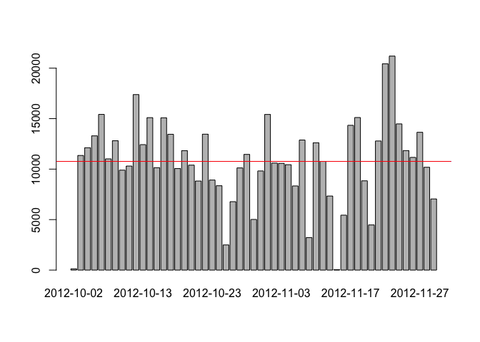
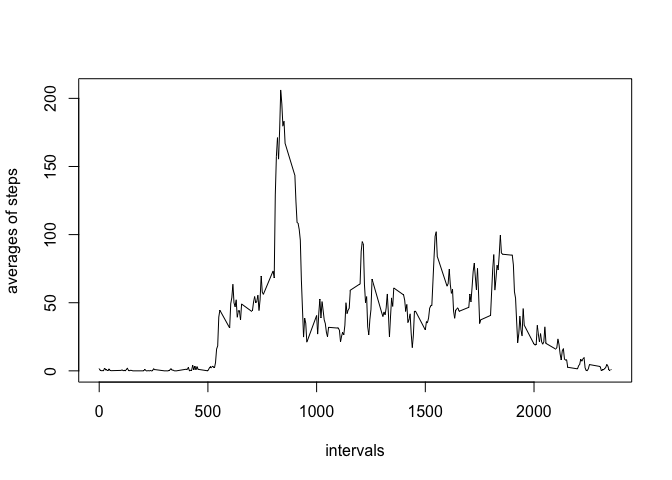
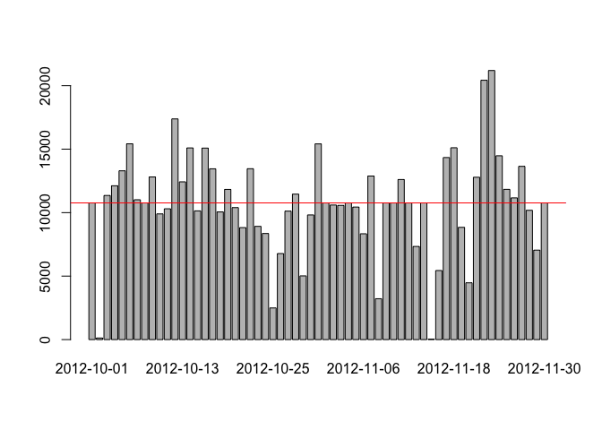
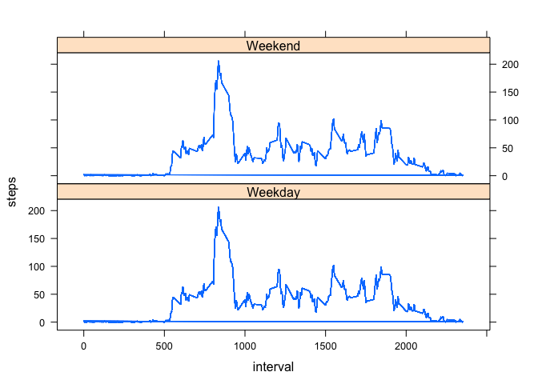

## Loading and preprocessing the data

1. unzipe the file


```r
unzip("./activity.zip")
```

2. load csv file


```r
activity <- read.csv("./activity.csv",sep=",", header=TRUE)
head(activity)
```

```
##   steps       date interval
## 1    NA 2012-10-01        0
## 2    NA 2012-10-01        5
## 3    NA 2012-10-01       10
## 4    NA 2012-10-01       15
## 5    NA 2012-10-01       20
## 6    NA 2012-10-01       25
```

## What is mean total number of steps taken per day?

1. calculate how many steps per day


```r
data <- aggregate(steps ~ date, data = activity, sum)
```

2. plot an histogram


```r
barplot(data$steps, names.arg=data$date)
abline(h=mean(data$steps),col="blue")
abline(h=median(data$steps),col="red")
```

<!-- -->

in this case mean and median so in this graph they are indistinguishable

3. Calculate and report the **mean** and **median** total number of steps taken per day


```r
mean(data$steps)
```

```
## [1] 10766.19
```

```r
median(data$steps)
```

```
## [1] 10765
```

## What is the average daily activity pattern?

1. calculate average steps per interval


```r
data <- aggregate(steps ~ interval, data = activity, mean)
```

2. plot data


```r
plot(data$interval, data$steps, type="l",xlab = "intervals", ylab = "averages of steps")
```

<!-- -->

## Imputing missing values

1. Calculate and report the total number of missing values in the dataset (i.e. the total number of rows with `NA`s)


```r
sum(is.na(activity))
```

```
## [1] 2304
```

2. fill missing data with mean of intervals and create a new dataset


```r
new_data <- activity
for(i in 1:nrow(new_data)) {
  if(is.na(new_data$steps[i])) {
    value <- data[which(new_data$interval[i] == data$interval),2]
    new_data$steps[i] <- value
  }
}
```

3. calculate how many steps per day


```r
data <- aggregate(steps ~ date, data = new_data, sum)
```

4. plot an histogram


```r
barplot(data$steps, names.arg=data$date)
abline(h=mean(data$steps),col="blue")
abline(h=median(data$steps),col="red")
```

<!-- -->

5. Calculate and report the **mean** and **median** total number of steps taken per day


```r
mean(data$steps)
```

```
## [1] 10766.19
```

```r
median(data$steps)
```

```
## [1] 10766.19
```

## Are there differences in activity patterns between weekdays and weekends?

1. Create a new factor variable in the dataset with two levels -- "weekday" and "weekend" indicating whether a given date is a weekday or weekend day.


```r
activity$date <- as.Date(strptime(activity$date,format = "%Y-%m-%d"))
activity$date <- weekdays(activity$date)
weekends <- c("Sabato", "Domenica")

for (i in 1:nrow(activity)) {
  if (activity$date[i] %in% weekends) {
    activity$day_type[i] <- "Weekend"
  } else {
    activity$day_type[i] <- "Weekday"
  }
}

activity$day_type <- as.factor(activity$day_type)
```

2. calculate average steps per interval


```r
data <- aggregate(steps ~ interval, data = activity, mean)
data <- cbind(data,activity$day_type)
```

2. Make a panel plot containing a time series plot (i.e. `type = "l"`) of the 5-minute interval (x-axis) and the average number of steps taken, averaged across all weekday days or weekend days (y-axis)


```r
library(lattice)
xyplot(steps ~ interval | activity$day_type, data = data, layout = c(1, 2),type="l")
```

<!-- -->


